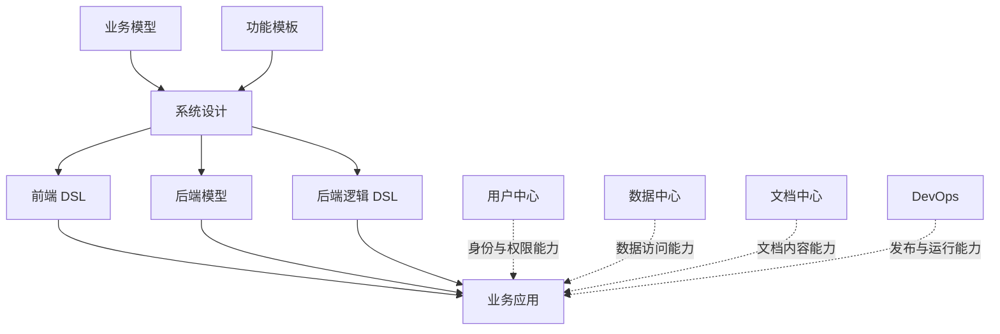

# 业务模型设计框架大纲

**编号：BMF-001 ｜ 版本：v0.1 ｜ 状态：评审稿 ｜ 日期：2026-10-08**

本文件是本项目的第一份业务模型框架产出物。以原始业务模型图为核心，以校园图书馆借阅系统验证概念之间的关系，定义业务模型的组成、设计模式、使用流程，以及上下游交付标准。

这是框架与合同的评审基线。本文件中的“必须”表示拟采用的规范要求，待讨论后纳入正式版本；不表示相关执行器、接口或工具已经实现。当前阶段不进入编码、工具安装和 PoC。

## 1. 框架目标与已确认边界

### 1.1 框架要解决的问题

将业务中的对象、行为、流程、事件、角色、文档和规则还原为统一的业务模型，使前端设计、后端设计和业务运行引用同一份业务定义。

框架应支持以下工作：

1. 业务人员用统一概念表达业务，能够说明规则来源和适用范围。
2. 设计人员从模型组织页面、表单、列表、工作台和交互流程。
3. 后端人员从模型设计数据访问、业务操作和执行约束。
4. 模型、连接引擎、模板和具体应用按各自节奏迭代，通过版本合同保持一致。
5. 每个设计和实现结果都能追溯到业务定义；模型变化后能够定位受影响的页面、接口和执行能力。

### 1.2 已确认方向与待定事项

| 事项 | 本框架采用的边界 | 当前状态 |
|---|---|---|
| 建模入口 | 业务本体支撑前端和后端设计；沿用原图七类概念 | 已确认方向 |
| 补充视角 | 关系、状态和指标单独定义，补足模型表达 | 本次框架提案 |
| 后端 | 使用 Node.js；模型管理与 Data Connect 为独立服务 | 已确认方向 |
| 数据库 | 当前只考虑 PostgreSQL | 已确认方向 |
| 数据连接 | 由 Data Connect 管理驱动、连接池、访问与事务；使用 `pg`，它是独立驱动包 | 已确认方向 |
| 接口与控制层 | 使用 GraphQL 表达数据接口，BFF 面向前端业务场景组织能力；GraphQL 与数据库访问实现分开 | 已确认方向；具体边界待细化 |
| 自动化范围 | 模型与模板共同支撑系统设计；是否生成、如何生成由模板和实现合同决定 | 本次框架提案 |
| 技术工具 | Meta Schema 格式、BFF 框架、规则与流程工具、DSL 语法和版本策略 | 待讨论，本文不锁定 |

### 1.3 业务模型的定义

**业务模型是一套有明确标识、类型、关系、约束和来源的业务定义，描述“业务中有什么、谁可以做什么、何时可以做、做后发生什么，以及如何观察结果”。**

它包含业务本体定义及其流程、参与者、文档和分析视角。业务对象是其中一类概念；模型还必须表达对象之间的关系、行为的前置条件与结果，以及业务状态的变化。

一个模型元素可参与多个视角。例如，采购订单既是业务对象，也是结构化业务单据，同时参与审批流程。按视角引用同一元素，避免另建相互矛盾的定义。

## 2. 以原图建立整体框架

### 2.1 原图的主线

原图左侧负责业务表达；中间的“业务模型 + 功能模板 → 系统设计”负责把业务定义转成应用设计；右侧三类设计产物共同支撑业务应用。用户中心、数据中心、文档中心及 DevOps 提供平台能力。

图中的箭头表示设计依赖或能力支撑。用户中心、数据中心、文档中心是平台职责，不据此确定部署拓扑或增加独立服务。

### 2.2 七类核心概念与三个补充视角

| 原图或补充项 | 框架概念 | 回答的业务问题 | 校园图书馆示例 |
|---|---|---|---|
| 业务对象 | Entity，对象类型及属性 | 业务中有哪些有身份、可追踪的事物？ | 读者、书目、副本、借阅、采购订单 |
| 业务行为 | Capability / Action，能力与操作 | 能查询什么、执行什么业务操作？ | 查询可借副本、借出、归还、续借 |
| 业务流程 | Process，业务协作与编排 | 一项目标如何跨步骤、跨角色完成？ | 采购申请到审批、下单、验收、入库 |
| 业务事件 | Event，已经发生的业务事实 | 发生了什么变化，后续谁需要响应？ | 借出完成、归还完成、验收完成 |
| 业务角色 | Actor / Role，参与者与职责 | 谁参与业务，具备什么职责和权限？ | 读者、馆员、采购员、审批人 |
| 业务文档 | Document，业务单据、内容与依据 | 业务需要哪些单据、附件和依据？ | 采购订单、验收单、借阅规章 |
| 业务规则 | Policy / Rule，策略与约束 | 什么条件必须成立，什么结果如何计算？ | 借阅上限、续借条件、独立审批 |
| 补充：业务关系 | Relationship，对象间关联 | 对象如何关联，关联数量和条件是什么？ | 一条借阅关联一名读者和一个副本 |
| 补充：业务状态 | State，对象生命周期 | 对象处于什么阶段，如何合法变化？ | 副本可借/借出；借阅未归还/已归还 |
| 补充：业务指标 | Metric，分析口径 | 怎样衡量业务结果，按什么粒度计算？ | 在借数、逾期数、本月借出量 |

Entity、Relationship、Capability、Policy、Event、State 构成本体语义的核心；Process、Actor / Role、Document、Metric 提供协作、参与者、文档和分析视角。

以上十项是建模视角，不对应十个微服务。指标按分析需求启用；流程、文档、事件等也按场景需要定义，不要求每个对象具备所有视角。

### 2.3 概念之间的引用规则

| 引用关系 | 规范含义 |
|---|---|
| 对象 → 关系 | 关系引用已定义的对象类型、标识或字段，声明方向、基数与可选性 |
| 行为 → 对象 | 操作引用业务对象，声明读取范围、输入、输出和业务效果 |
| 角色 → 行为 | 角色定义可执行的操作及对象、字段范围；实际身份从可信上下文获得 |
| 规则 → 对象 / 行为 / 状态 / 查询 | 规则声明适用范围；作用范围不限于流程 |
| 状态 → 行为 / 规则 | 状态迁移引用触发操作和守卫规则，明确前后状态 |
| 流程 → 行为 / 角色 / 事件 | 流程编排已定义操作，分配参与者，处理等待、分支和异常 |
| 行为 → 事件 | 操作成功可以产生业务事实；事件是否通知其他系统另由实现绑定决定 |
| 文档 → 对象 / 规则 / 流程 | 单据引用对应对象；依据文档支撑规则；附件可参与流程 |
| 指标 → 对象 / 关系 / 事件 | 指标引用事实来源并定义粒度、过滤和时间口径 |

## 3. 区分四个定义层次

| 层次 | 定义内容 | 示例 | 主要归属 |
|---|---|---|---|
| 元规范层：Meta Schema | 可定义哪些元素、字段和引用，如何检查模型结构 | Entity 的属性合同；Action 的输入输出合同 | 框架与模型管理能力 |
| 业务模型层 | 某个业务领域的类型、关系、行为和约束 | `loan`、`library_loan_borrow`、`rule/unique_copy_loan` | 业务模型及其版本 |
| 应用设计与绑定层 | 页面组织、数据映射、接口投影和执行实现 | 馆员借出页；借阅表映射；借出操作实现 | 系统设计、模板、应用实现 |
| 运行实例层 | 用户、记录、事件、审批和审计等实际数据 | 某笔借阅；某版本借阅政策参数 | 业务系统与平台运行数据 |

Meta Schema 描述业务模型的结构，业务模型描述具体业务，应用设计把业务定义连接到实现，运行数据体现实际业务实例。

`loan_policy` 的一条记录可承载某个已生效政策版本的参数；关于“在用政策不可变”的规则属于模型定义。二者需要关联，但不混用版本编号。

## 4. 模型元素的最小概念合同

### 4.1 全部元素共用的元信息

下列名称是合同的工作名称，用于评审语义。正式键名、序列化格式和校验器在后续选型时确定。

| 元信息 | 最小要求 |
|---|---|
| 模型与元素标识 | 模型标识、元素类型、稳定元素标识；引用定位到这三项及需要的模型版本 |
| 名称与定义 | 面向业务的名称、边界与含义；机器标识与显示名称分开 |
| 责任人 | 负责解释和批准定义的业务责任人；可另设技术维护人 |
| 依据 | 来源文档、访谈、现有系统或已确认需求的引用与版本 |
| 依赖 | 明确引用的元素；引用可解析，禁止仅在描述中隐藏关键依赖 |
| 适用范围 | 领域、场景、组织或时间范围；不适用的范围可注明 |
| 变更记录 | 所属模型版本、变更理由、兼容性与受影响项 |
| 完整度与实施状态 | 定义是否完整、是否校验、是否已绑定和验证；待定事项显式记录 |

显示名称可变更，稳定标识不应随之变化。导入现有模型时保留原始标识或建立明确别名映射，不为了统一命名静默重写引用。

### 4.2 各类元素的定义要求

| 元素 | 必须能表达的内容 | 设计边界 |
|---|---|---|
| 对象 Entity | 身份与粒度；属性及类型；必填、可空、枚举和唯一性；业务约束；数据责任与访问范围 | 一个业务对象可映射多张表、视图或外部能力；对象定义不等于物理表定义 |
| 关系 Relationship | 源与目标；业务含义；关联键；基数；可选性；关系成立条件 | 物理外键、查询连接或多态关联由后端映射说明；声明关系不自动保证数据库约束 |
| 行为 Action | Query / Command 分类；输入输出；执行角色与范围；前置条件；读取与改变的对象；规则、状态及事件引用；结果与错误语义 | Capability 可归组多个 Action；真正执行合同落实到具体 Action |
| 规则 Policy / Rule | 规则种类；明确作用域；条件与结果；优先级或冲突处理；有效期与版本；来源及可解释原因 | 自然语言可用于评审；可执行表达式或实现绑定必须另行说明 |
| 状态 State | 所属对象；状态集合；初始与终止状态（适用时）；合法迁移；触发操作；守卫；迁移效果 | 状态为对象生命周期定义；流程任务状态与业务对象状态分别管理 |
| 事件 Event | 过去时业务含义；事件标识；主体；发生时间；发出者；负载；因果或关联标识；可见范围 | 事件定义不默认采用消息队列；发布、重试与消费保证由绑定合同定义 |
| 流程 Process | 目标；触发与结束条件；步骤、分支和等待；参与者；操作引用；异常、超时和补偿；业务证据 | 简单操作不强制包成流程；一个操作内部的事务步骤不自动成为业务流程 |
| 参与者 / 角色 | 人或系统参与者类型；业务角色职责；可信身份映射；授权操作；对象与字段范围；职责分离 | 业务角色与用户分类、岗位名称分别定义；前端传入角色不能作为授权依据 |
| 文档 Document | 结构化单据或非结构化内容分类；关联对象；模板或内容类型；版本；生成者；依据或附件用途；访问和保留要求 | 结构化单据复用 Entity 定义；正文与附件可交给文档中心管理 |
| 指标 Metric | 业务含义；公式；事实粒度；维度；过滤范围；时间窗口或快照；单位；空值与去重语义；来源与可见范围 | 指标不能仅以名称或 SQL 片段代表完整口径 |

所有对象都定义粒度和身份；只有确有生命周期的对象才需要状态机。所有会改变业务的命令都需要明确规则和结果；是否需要审批、事件或文档按场景判断。

### 4.3 容易混淆的概念

| 概念对 | 本框架的区分 |
|---|---|
| 类型与实例 | `loan` 是类型定义；具体借阅编号对应运行实例 |
| 用户分类与业务角色 | `reader_type=STAFF` 表示员工读者；`LIBRARIAN` 表示馆员业务角色 |
| 操作者与目标对象 | 馆员执行借出，输入的 `user_id` 是借书读者；二者不应被视为同一个人 |
| 持久状态与派生标记 | 借阅状态为 `OPEN` 等；逾期由到期时间与 `as_of` 派生，不增加 `OVERDUE` 持久状态 |
| 业务事件与审计 | `loan_event` 记录借出等业务事实；`audit_event` 记录谁调用什么操作及其结果 |
| 单据与附件 | 采购订单字段复用订单对象；合同扫描件是相关文档内容 |
| 业务规则与页面校验 | 页面校验帮助及时反馈；业务执行端承担最终规则判断 |
| GraphQL 与数据访问实现 | GraphQL 定义接口类型和操作；`pg` 等负责 PostgreSQL 连接、SQL 和事务 |

## 5. 建议采用的设计模式

这些模式用于模型评审与应用设计，不要求提前选定某个软件产品。

| 模式 | 适用条件 | 设计约束 | 校园图书馆示例 |
|---|---|---|---|
| P01：类型与实例分离 | 同类业务事物有多个可独立管理的实例 | 为不同粒度建立不同身份和关系，避免把类型属性与实例状态混合 | `book_title` 表示书目；`book_copy` 表示可借的一本实体副本 |
| P02：规范定义与场景投影 | 多个页面或接口使用同一业务对象 | 场景投影引用字段与关系，可组合多个对象；保留来源和授权范围 | “我的借阅”组合借阅、书目和副本；副本成本不进入读者投影 |
| P03：查询与命令分离 | 系统同时提供查询和业务操作 | Query 不改变业务状态；Command 定义效果、权限、幂等和失败语义 | 查询可借副本与执行借出是不同合同 |
| P04：带守卫的状态迁移 | 对象只能按合法路径变化 | 迁移引用操作和规则；并发写入时在执行端检查当前状态和约束 | 副本 `AVAILABLE → ON_LOAN`；新建借阅 `OPEN` |
| P05：角色、操作与资源范围结合 | 同一操作在不同身份下可访问不同对象 | 可信身份决定角色；角色与资源范围共同决定权限；读写与字段授权分别表达 | 读者查看自身借阅；馆员办理借出；管理员不默认获得所有业务操作 |
| P06：流程复用行为 | 多步骤业务涉及协作、等待或审批 | 流程引用既有 Action；明确等待、分支、超时与补偿；不在流程中重写规则 | 采购申请、审批、订单、验收、入库复用各自操作 |
| P07：政策参数与稳定规则分离 | 业务约束稳定，但参数按时间或人群变化 | 模型定义参数含义与约束；运行政策版本提供取值；历史交易保留当时版本 | 借阅关联借出时的 `policy_id`；续借使用该版本参数 |
| P08：文档与业务证据关联 | 规则有依据，操作需保留单据或证据 | 结构化业务字段复用对象；内容保存版本和关联；审批绑定对象修订与快照 | 审批任务关联订单修订、操作意图和内容摘要 |
| P09：事实粒度与指标口径分离 | 跨对象关联后进行统计 | 先按事实粒度计算，再组合结果；明确窗口与快照；禁止连接放大 | 借阅粒度是一笔借出一个副本；在借数与本月借出量使用不同时间语义 |
| P10：模型定义与实施绑定分离 | 模型和运行引擎独立发展 | 发布版本稳定可引用；模板、数据库映射、执行器按合同绑定；缺失能力有明确状态 | 模型先供页面设计使用，借出操作需完成执行绑定才能启用 |

### 5.1 对事件与执行一致性的约束

业务事件描述已发生事实。命令失败不能产生“借出完成”事件。命令结果、对象变化和事件之间必须有明确的一致性策略。

对于同一 PostgreSQL 数据库中的借出操作，建议把借阅、副本状态、业务事件、成功审计和幂等结果纳入同一事务；拒绝或失败的审计应采用不会随业务事务回滚而丢失的记录路径。涉及外部系统时，另行定义待处理结果、重试、回读或补偿，不宣称跨系统天然原子化。[S4]

消息代理、Outbox、流程引擎等属于后续执行方案选项，本框架先要求一致性语义可说明、可验证。

## 6. 模型的使用流程与阶段产出

| 阶段 | 主要工作 | 应交付内容 | 进入下一阶段的条件 |
|---|---|---|---|
| 1. 业务输入 | 明确目标、边界、角色、现状和需求依据 | 业务需求输入包、术语表、场景列表 | 责任人和来源可识别；未知事项有记录 |
| 2. 本体还原 | 识别对象、关系、行为、规则、状态和其他所需视角 | 业务元素目录、定义卡、引用关系 | 粒度和语义明确；关键冲突已标识 |
| 3. 场景推演 | 按角色推演正常、拒绝、异常和并发情况 | 场景到元素的追溯矩阵、规则示例 | 关键业务效果和权限边界能解释 |
| 4. 模型校验 | 检查结构、引用、语义和定义完整度 | 校验结果、问题清单、评审记录 | 本次发布范围满足模型合同 |
| 5. 模型发布 | 固化可引用版本，声明内容与完成度 | 业务模型发布包 | 版本、依赖和未完成项明确 |
| 6. 系统设计 | 选择模板，设计场景投影、页面、映射和执行绑定 | 系统设计包、三类下游定义、覆盖矩阵 | 每项设计能追溯到模型与模板版本 |
| 7. 实施准备 | 明确适配器、执行器和平台能力的支持范围 | 实施绑定与验证计划 | 工具和方案讨论完成，再开展 PoC |

业务模型发布可以服务于评审和页面设计；运行启用只针对已完成所需绑定和验证的能力。未启用的功能显式标记，不能因概念定义存在而开放执行入口。

### 6.1 一个模型如何组织多个应用

同一业务模型可支持读者端、馆员端、采购端等多个应用。每个应用选择自己的场景和投影，引用同一套对象、操作、规则与指标。

页面数量由业务任务和使用场景决定。一个工作台可以使用多个对象，一个对象也可以出现在多个页面中。页面布局、交互细节和组件选择属于系统设计，不写入对象的业务含义。

## 7. 上游标准：业务需求输入包

### 7.1 输入内容

| 输入项 | 最低要求 | 图书馆示例 |
|---|---|---|
| 目标与业务范围 | 要解决的问题、范围内与范围外能力、预期结果 | 借还续借与采购入库；是否纳入罚款另行决定 |
| 场景与参与者 | 触发、目标、执行者、目标对象、正常与异常路径 | 馆员替读者借出副本；副本不可借时拒绝 |
| 术语与对象 | 原始名称、业务定义、粒度、身份及同义词 | 书目与副本区别；借阅按一次借出一个副本计 |
| 规则与状态 | 来源、适用条件、例外、冲突及责任人 | 借阅上限；逾期是否阻止续借；正常归还不被阻止 |
| 角色与授权 | 业务职责、身份依据、对象及字段范围、职责分离 | 读者只看自己；审批人与申请人独立 |
| 文档与数据来源 | 业务依据、样例单据、拟建或已存在数据源、来源版本 | 借阅规章；订单样例；现有副本目录 |
| 分析需求 | 指标名称、计算意图、事实粒度、时间口径与查看者 | 本月借出量；当前在借数 |
| 不确定事项 | 假设、待确认项、冲突、确认人和影响范围 | 历史副本是否都有验收来源 |
| 验收示例 | 可复核的业务输入、预期结果和拒绝理由 | 同一副本并发借出只能成功一次 |

### 7.2 输入质量要求

1. 区分“拟建”“现有”“已核实”的来源状态；每个关键规则和指标保留依据。
2. 缺失、未知、不适用分别记录。未说明必填与可空的字段不能自动被当作已确认字段合同。
3. 口头需求、现有页面和数据库字段均可作为输入；其对应业务含义需由责任人确认。
4. 自动提取的概念或规则保留来源与推断标记；有冲突时进入问题清单，由业务责任人决定。
5. 输入包应包含能反驳错误理解的例子，例如“读者暂停借阅后仍可正常归还”。

输入验收首先检查业务含义和证据，不以文件可以解析作为业务需求完整的证明。

## 8. 中间标准：业务模型发布包

### 8.1 发布包组成

| 组成 | 合同要求 |
|---|---|
| 包标识与版本 | 模型标识、模型版本、元规范合同版本、发布记录、责任人、完整性摘要 |
| 业务元素 | 本次范围内的对象、关系、操作、规则、状态及所需扩展视角 |
| 类型与约束 | 字段类型、枚举、必填、可空、唯一性、输入输出与错误语义 |
| 引用与依赖 | 元素引用、外部模型依赖、支持的规范版本与必要特性 |
| 来源与追溯 | 需求、文档、原始标识与模型元素的对应关系 |
| 评审与校验结果 | 执行过的校验、结果、评审决定及仍未完成的事项 |
| 能力状态 | 各能力的定义完整度、绑定状态、验证状态和可用范围 |
| 变更与兼容性 | 新增、修改、废弃项及对上下游的影响 |

物理数据库连接信息、密钥和运行业务记录由对应平台能力管理；发布包引用绑定标识和环境配置标识。

### 8.2 字段与行为合同的表达原则

JSON Schema 可作为输入输出结构合同的候选规范，但具体方言和工具尚未敲定。业务不变量和跨对象约束仍由规则及执行绑定表达。

必须显式区分：

- 字段是否必须出现，与字段值是否可为 `null`。
- 字段枚举与自由文本；展示描述中的枚举需要转成正式约束。
- 默认值提示与运行时补值行为。JSON Schema 的 `default` 本身不会在验证时填入缺失值。[S1][S2]
- 已知结果字段与扩展字段。通用开放 `data` 对象需由具体操作或投影补足结果类型。
- 全局规则与指定对象、操作、状态或流程的规则。空操作列表不能默认为“适用全部”或“不适用任何”。

Query 至少定义参数、结果结构、授权过滤、排序分页及分析口径（适用时）。Command 至少定义参数、结果、效果、规则、授权、幂等、并发与一致性要求。

### 8.3 完整度与可执行性

| 维度 | 应记录的状态 | 含义 |
|---|---|---|
| 定义 | 草稿 / 已定义 | 业务含义和本次范围所需合同是否完整 |
| 校验 | 未校验 / 已校验 / 有阻塞问题 | 结构、引用及语义检查的实际结果 |
| 实现 | 未绑定 / 已绑定 | 数据映射和所需执行能力是否有明确实现 |
| 验证 | 未验证 / 已验证 | 实现是否通过相应业务与运行验证 |
| 可用范围 | 设计可用 / 指定功能可执行 | 说明可以被哪些设计或运行能力消费 |

“已定义”“已校验”“可执行”各自有证据。发布包可以包含尚未实现的定义，运行端只启用已满足自身依赖的能力，并拒绝必需特性不受支持的绑定。

## 9. 下游标准：系统设计与实现绑定

### 9.1 系统设计包

系统设计引用确定的模型版本，说明应用面向哪些角色、覆盖哪些场景、使用哪些模板，以及形成哪些页面和后端能力。它是原图中从业务定义到三类设计产物的连接点。

最低交付内容：应用范围与场景表、角色到场景的授权投影、页面与操作追溯、模板及版本、数据与执行绑定、人工扩展项、未支持项，以及设计验收示例。

### 9.2 三类设计产物合同

| 产物 | 必须引用与定义 | 可自行决定的部分 | 需满足的边界 |
|---|---|---|---|
| 前端 DSL / 页面定义 | 模型版本；字段、关系、查询和命令引用；场景投影；可见范围；状态与错误反馈 | 布局、组件、交互、导航、展示格式 | 页面校验引用共同规则；权限和写入仍由执行端验证；不自行改写指标口径 |
| 后端模型 / 数据映射 | 模型版本；对象及字段到表、视图或能力的映射；类型转换；关系与约束实现；查询投影；迁移要求 | 存储结构、索引、查询计划和性能实现 | 对象粒度、唯一性与业务语义不因物理映射改变；拟建来源不能冒充已接通来源 |
| 后端逻辑 DSL / 执行定义 | 模型版本；Action、Rule、State、Process、Event 引用；执行器或人工实现绑定；结果与异常语义 | 执行组织与适配方式；在合同内选择规则或流程工具 | 最终授权、业务守卫、幂等和一致性有执行责任；不把声明性文本视为已部署逻辑 |

“后端逻辑 DSL”在本阶段表示业务执行定义这一产物类别，具体语法和引擎留待讨论。

### 9.3 平台与服务消费合同

| 消费方 | 输入 | 输出或责任 | 独立迭代边界 |
|---|---|---|---|
| 模型管理服务 | 业务模型草稿、Meta Schema、评审记录 | 管理定义与版本；发布不可变、可引用的模型包 | 元规范和模型治理可独立发展 |
| Data Connect | 已发布模型、后端映射、环境配置引用、执行绑定 | PostgreSQL 连接与访问；加载支持的定义；查询与事务能力；执行侧公共业务能力 | 引擎、适配器与业务模块分别声明版本；不随每次模型修改同步升级 |
| BFF | 场景定义、可信身份、公共操作合同 | 面向页面组织接口和结果；传递执行上下文与关联标识 | 按前端场景发展；共同业务规则由公共执行侧负责 [S3] |
| 前端 | 页面定义、场景投影、操作及反馈合同 | 展示、交互、输入辅助和结果反馈 | 使用确定模型与接口版本；不获得数据库连接能力 |
| 用户中心 | 参与者、角色及授权映射 | 可信身份、角色和范围上下文 | 身份实例与业务角色定义建立明确映射 |
| 文档中心 | 文档类型、版本、权限与对象关联 | 内容、附件、版本和检索能力 | 结构化业务字段仍由相应业务对象定义 |
| 功能模板 | 模型合同版本、所需特性、场景参数 | 生成或组织设计结果；说明支持范围与扩展点 | 模板声明版本与生成归属；重生成不覆盖人工扩展 |
| DevOps | 模型、模板、实现、环境与发布版本清单 | 可重复发布、运行观测、回退与变更记录 | 记录实际启用的版本组合及数据迁移限制 |

Data Connect 在运行时使用已加载的发布版本，不要求每次业务请求访问模型管理服务。模型管理服务的数据存储和平台启动路径另行设计，避免通过尚未加载的业务模型才能读取元模型的循环依赖。

### 9.4 行为执行合同

| 项目 | 规范要求 |
|---|---|
| 身份与授权 | `actor`、角色和范围来自可信上下文；输入中的目标用户不替代操作者身份 |
| 规则执行 | 指明哪个公共执行模块负责规则；Query 的行与字段范围也必须执行 |
| 预览与正式执行 | 若操作要求预览，明确两阶段关联、输入一致性、有效期和变更后的处理；一个 `preview_only` 布尔值不足以证明已经完成预览 |
| 幂等 | 定义请求标识作用域、规范化业务参数、重复成功与冲突语义；预览不能抢占正式执行结果 |
| 并发 | 声明必须保持的不变量及执行手段；同一副本唯一在借与同一读者借阅上限均需保护 |
| 结果 | 区分成功、拒绝、失败与待处理；定义每个操作的数据结构、原因码、证据和关联标识 |
| 事务与外部副作用 | 声明原子范围；同库事务使用同一连接；外部执行说明重试、回读或补偿 [S4] |
| 审计与事件 | 说明记录时点、关联标识和可见范围；业务事实与执行审计分别表达 |

模板支持不足时，可按合同人工实现并绑定原操作。生成覆盖率不代表业务可用率，业务可用性由绑定与验证结果决定。

## 10. 版本与上下游变更标准

### 10.1 版本分别管理

| 版本 | 表达内容 | 不能替代 |
|---|---|---|
| 元规范合同版本 | 模型结构、类型、引用与校验规范 | 某个业务模型的版本 |
| 业务模型版本 | 领域业务定义及其变更 | 执行引擎或运行政策版本 |
| 模板版本 | 模型到设计结果的模板行为 | 页面本身与模型的版本 |
| 应用设计版本 | 前端定义、接口投影和后端绑定的组合 | 模型管理服务软件版本 |
| 实现与引擎版本 | Data Connect、BFF、执行模块等软件与能力 | 业务含义是否改变 |
| 运行政策 / 对象修订 | 参数生效版本、订单修订及审批快照 | 元规范和发布模型版本 |

具体版本编号策略待确定。当前 `campus_library.yaml` 声明 `version: 0.1.2`，先记录为来源声明版本；在其语义确认前，不直接解释为上述多个版本。

### 10.2 变更影响评审

| 变化 | 至少检查的下游影响 |
|---|---|
| 对象、字段或稳定标识修改 | 页面引用、接口类型、存储映射、迁移和历史数据 |
| 必填、可空或枚举变化 | 表单、调用方、结果解析、数据约束与已有实例 |
| 关系与粒度变化 | 查询连接、场景投影、授权范围和指标聚合 |
| 规则、权限或政策变化 | 合法操作范围、历史交易适用版本、拒绝原因与审计 |
| 状态或迁移变化 | 页面操作入口、进行中实例、流程任务和外部响应 |
| 指标口径变化 | 看板、报表、历史可比性、口径标签和缓存 |
| 执行绑定或模板变化 | 语义保持、生成差异、扩展代码与必要验证 |

不根据“只是新增字段”自动判定兼容。发布记录声明变更影响，消费方报告支持的规范版本和必需特性。模型、模板和执行绑定形成可追溯版本组合；回退还需考虑数据迁移和外部副作用。

## 11. 校园图书馆案例：从模型到应用设计

### 11.1 案例输入的实际状态

`campus_library.yaml` 当前包含 15 个数据集、135 个字段、28 条关系、12 个指标、60 个操作（35 个查询、25 个命令）和 19 条规则。

来源将自身标注为概念合同，尚未部署；`semantic.*` 是拟建语义视图。已有文件可以作为框架推演的业务输入，但实际数据映射、完整字段约束、类型化结果，以及正式状态机、流程与事件合同仍需补齐。

| 已有内容 | 可复用部分 | 需要形成的正式定义 |
|---|---|---|
| 数据集与字段 | 对象目录、属性、粒度描述、主键与唯一键 | 必填、可空、枚举、数据责任、访问范围与物理映射 |
| 关系 | 源目标和字段关联 | 业务基数、可选性与成立条件的统一合同 |
| 操作 | Query / Command、输入结构、角色和业务说明 | 具体输出、错误、授权范围、规则关联和实施绑定 |
| 规则 | 业务约束及部分引用 | 明确作用域、形式化条件或实现绑定、冲突与解释方式 |
| 状态、事件、流程、文档线索 | 字段描述、`loan_event`、审批对象和操作说明 | 对应视角的显式定义；不能从已有名词推断其执行实现已经存在 |
| 指标 | 12 个指标的业务口径与来源表达 | 明确可用数据映射、查询实现和验证证据 |

### 11.2 以“馆员为读者借出一个副本”推演

本场景是模型推演样例。下表中的源标识沿用 YAML；新增流程或页面名称仅用于说明设计方向。

| 视角 | 模型引用或定义内容 | 对设计的支撑 |
|---|---|---|
| 对象 | `library_user`、`book_title`、`book_copy`、`loan`、`loan_policy` | 区分操作者、读者、书目、副本和借阅记录；确定展示字段 |
| 关系 | `loan_to_library_user`、`loan_to_book_copy`、`loan_to_loan_policy`、`book_copy_to_book_title` | 查询借阅明细与关联政策；投影书目和条码 |
| 行为 | `library_loan_borrow`；相关查询 `library_available_copies` | 提供可借副本查询与正式借出操作 |
| 角色 | 借出操作只允许 `LIBRARIAN`；输入 `user_id` 为目标读者 | 页面入口按角色设计；执行端核实馆员与目标读者范围 |
| 规则 | `rule/trusted_role_and_scope`、`rule/eligible_borrower`、`rule/copy_available`、`rule/unique_copy_loan`、`rule/policy_immutable` | 解释可借条件与拒绝原因；约束执行一致性 |
| 状态 | 副本 `AVAILABLE → ON_LOAN`；创建 `OPEN` 借阅；保存借出时政策版本 | 可借展示与成功反馈；形成待正式定义的迁移合同 |
| 事件 | 已有 `loan_event` 中的 `BORROW` 事实记录 | 追踪业务历史；独立的事件发布合同仍待定义 |
| 流程 | 若业务需要，定义借出确认过程并引用原操作 | 预览、确认和异常反馈是交互设计；执行事务内部步骤单独定义 |
| 文档 | 借阅规章是规则依据；本场景尚未要求独立借阅凭证 | 引用依据；如需凭证再定义文档类型和模板 |
| 指标 | `open_loan_count`、`period_borrow_count` | 区分当前在借快照与期间借出量；一次借出贡献一个借阅事实 |

### 11.3 三类设计产物的映射

| 设计产物 | 本场景应形成的设计 |
|---|---|
| 前端定义 | 馆员选择读者与副本，展示政策及校验反馈，预览并确认借出；查询与命令引用原模型 |
| 后端模型 | 映射读者、副本、政策、借阅与事件；保持副本唯一在借和借阅粒度；定义时间与类型转换 |
| 后端执行定义 | 绑定 `library_loan_borrow`，从可信身份核实馆员；执行资格与政策守卫，处理幂等和并发，事务写入与回读 |
| BFF 场景接口 | 组织查询与操作反馈，传递身份及请求关联信息；使用公共业务操作 |
| 读者端投影 | “我的借阅”引用 `library_my_loans`；同一业务记录根据读者权限生成相应字段投影 |

### 11.4 案例的关键验收语义

以下是未来验证要求，当前不宣称已经实现或通过：

1. 同一副本并发借出只能形成一笔有效在借；同一读者并发借出仍满足政策上限。
2. 借出保留当时政策版本；续借引用该版本，按原到期时间增加续借天数。
3. 暂停或逾期可影响新借、续借，不能阻止正常归还。
4. 在借为 `status=OPEN` 且 `returned_at IS NULL`；逾期另按 `due_at < as_of` 判定，相等时不逾期。
5. 读者只访问允许的自身借阅和公共书目；成本等受限字段不进入读者投影。
6. 当前快照与期间指标分开；时间区间采用左闭右开，业务时区为 `Asia/Shanghai`；关联采购或事件不会放大借阅计数。
7. 重复请求不重复借出；拒绝原因、业务事件和审计可以通过请求标识追溯。

## 12. 框架评审与模型验收标准

### 12.1 模型层检查

| 检查面 | 通过要求 |
|---|---|
| 概念完整性 | 本次场景所需视角有定义；不适用项说明理由 |
| 对象与关系 | 粒度、身份、基数、可选性明确；所有必要引用可解析 |
| 行为与结果 | 输入、输出、效果、拒绝和错误可解释；查询与命令边界明确 |
| 规则与状态 | 作用域明确；状态迁移合法；派生标记、政策版本和历史语义明确 |
| 角色与范围 | 可信身份、操作者与目标对象、行与字段范围、职责分离清楚 |
| 流程、事件与文档 | 所需协作、等待、业务事实和证据可追踪；与事务、审计分别表达 |
| 指标与时间 | 公式、粒度、维度、窗口/快照、去重和来源明确 |
| 追溯与变更 | 定义有依据；模型、模板和设计版本可定位；待定事项和影响已记录 |

### 12.2 下游设计检查

前端、后端模型与后端执行定义必须引用确定的模型版本，并形成“场景 → 模型元素 → 设计产物 → 实现绑定 → 验证证据”的追溯关系。

同一个规则、指标或状态含义只能有一份规范业务定义。为性能和交互存在多个实现时，需要声明来源及一致性验证。运行前检查所需映射和执行能力；运行验证不替代业务模型评审，模型校验也不替代运行验证。

### 12.3 当前来源核对的限度

已核对 YAML 可解析、上述元素数量及显式对象/字段/操作引用；原始文件保持不变。此核对不覆盖全部 JSON Schema 的元规范验证，也不证明 SQL、权限、并发或规则执行正确。对应证据在后续实际完成检查时追加。

## 13. 后续讨论顺序与待定决策

先敲定模型合同，再选择能满足合同的工具。当前大纲建议按以下顺序讨论。

| 顺序 | 需要敲定的问题 | 对应产出 |
|---|---|---|
| 1 | 十个建模视角、共用元信息、各类最小定义；是否按场景分级要求 | 元规范概念清单与元素定义卡 |
| 2 | 字段类型、必填/可空、枚举、引用、输入输出、错误和发布包格式 | Meta Schema 合同及样例 |
| 3 | 规则种类与作用域；状态迁移；规则形式与执行责任 | 规则、状态合同与执行方案 |
| 4 | 流程、事件与文档需要表达到什么程度；哪些能力先做 | 协作与事件/文档合同、工具选型 |
| 5 | 页面投影、前端 DSL、模板边界和人工扩展方式 | 前端设计与模板合同 |
| 6 | 模型服务与 Data Connect 的接口、加载与存储启动方式 | 服务合同、数据映射与版本支持方案 |
| 7 | GraphQL 类型投影、BFF 场景边界、身份传递、幂等与事务 | 后端接口及执行合同、框架选型 |
| 8 | 发布、变更、观测和验收方式；选取最小业务切片 | PoC 范围、验证计划与进入条件 |

工具选型项包括 Schema 校验器、规则表达与执行工具、流程工具、BFF 框架、DSL 实现方式及身份平台绑定。它们均以已讨论的合同为输入，不提前固定在本大纲中。

## 附录 A：元素定义卡与追溯表

### A.1 通用元素定义卡

| 项目 | 填写内容 |
|---|---|
| 模型 / 类型 / 标识 / 名称 | 确定元素身份与显示名称 |
| 定义与业务粒度 | 明确含义、边界、适用与不适用范围 |
| 责任人与依据 | 业务责任人、来源引用及来源版本 |
| 本类型必需合同 | 按第 4 节填写字段、行为、规则、状态等定义 |
| 元素依赖 | 引用对象、操作、规则、事件或外部模型 |
| 业务例子与反例 | 正常、拒绝、异常或边界样例 |
| 下游投影与绑定 | 已知页面、接口、数据与执行依赖 |
| 版本与完成度 | 定义、校验、绑定、验证状态与未完成项 |

### A.2 场景追溯表

| 场景 | 需求依据 | 模型元素 | 前端投影 | 数据映射 | 执行绑定 | 验证证据 |
|---|---|---|---|---|---|---|
| 馆员借出副本 | 借阅政策与柜台场景 | `loan` / `book_copy` / `library_loan_borrow` 等 | 馆员借出页面，待设计 | 拟建，待映射 | 待选择与实现 | 待 PoC 验证 |
| 读者查看我的借阅 | 读者访问场景 | `library_my_loans` 等 | 读者借阅列表，待设计 | 拟建，待映射 | 查询授权待实现 | 待验证自身范围与字段范围 |

## 附录 B：外部标准的使用位置

| 参考 | 可帮助解决的问题 | 本框架的使用边界 |
|---|---|---|
| JSON Schema | 输入输出及部分模型结构的类型和约束 | 候选结构合同；方言和校验工具待选，不代替跨对象业务规则 |
| GraphQL Schema | 数据接口类型与操作表达 | 接口投影；不承担 PostgreSQL 连接或事务实现 [S5] |
| BPMN | 正式业务流程的协作表达与交换 | 后续流程方案候选；不要求当前全部流程使用 BPMN [S6] |
| W3C PROV | 定义、数据、活动与参与者的来源追溯概念 | 参考其溯源思路；不据此强制 RDF、OWL 或知识图谱存储 [S7] |

### 来源记录

- 原始核心图：`image.png`；SHA-256：`69db66e59ec3e9ef34742168708991b748c57dbadca90f0154b1b496c2d53d9a`。
- 案例来源：`campus_library.yaml`；来源声明版本 `0.1.2`；SHA-256：`3826ef55a4f3824b8f497a25da8490c4f0afc9d0e8a6a63f307dc00bd420fe6c`。
- 本文的框架合同、设计模式及完成度标准为本次设计提案；案例具体对象与约束来自上述来源及已确认讨论。

### 官方参考

- [S1] JSON Schema：对象、`required` 与附加属性：[Object reference](https://json-schema.org/understanding-json-schema/reference/object)。
- [S2] JSON Schema：`default` 等注解语义：[Annotations](https://json-schema.org/understanding-json-schema/reference/annotations)。
- [S3] GraphQL：业务授权责任：[Authorization](https://graphql.org/learn/authorization/)。
- [S4] node-postgres：事务与同一客户端连接：[Transactions](https://node-postgres.com/features/transactions)。
- [S5] GraphQL：类型与 Schema：[Schemas and Types](https://graphql.org/learn/schema/)。
- [S6] OMG：BPMN 2.0.2 规范页面：[BPMN specification](https://www.omg.org/spec/BPMN/2.0.2)。
- [S7] W3C：PROV 规范族概览（非规范性概览文档）：[PROV Overview](https://www.w3.org/TR/prov-overview/)。
